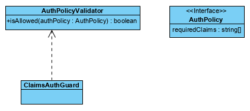

# Angular
## Reactive Forms
Er wordt gebruik gemaakt van reactive forms omdat dan de validatie logica in het component geplaatst wordt.
https://www.pluralsight.com/guides/difference-between-template-driven-and-reactive-forms-angular

## Authenticatie en Authorisatie
Er wordt gebruik gemaakt van permission based access vanwege onderhoudbaarheid en uitbreidbaarheid. PBA ondersteunt dat beter dan RBA. (Role based)


Dit is een beetje vergelijkbaar met de policies in ASP.NET. Een `AuthPolicy` bevat een array met `requiredClaims`. De `AuthPolicyValidator` checkt of de gebruiker alle required claims heeft en zo ja, geeft de `isAllowed()`-methode `true` terug. De validator is een aparte klasse omdat het op twee plaatsen wordt gebruikt. In het navigatiecomponent waar linkjes verborgen worden voor niet-geauthoriseerde gebruikers en in route defenities. De routes gebruikt de `ClaimsAuthGuard` die vervolgens weer een `AuthPolicyValidator` gebruikt.

```ts
const routes: Routes = [
{
    path: 'oefeningen/:id',
    component: OefeningPage,
    pathMatch: 'full',
    canActivate: [ClaimsAuthGuard],
    data: { authPolicy: AuthPolicies.KanOefeningenZienPolicy }
},
{
    path: 'oefeningen',
    component: OefeningenOverzichtPage,
    canActivate: [ClaimsAuthGuard],
    data: { authPolicy: AuthPolicies.KanOefeningenZienPolicy }
},
{
    path: 'nieuwe-oefening',
    component: OefeningFormComponent,
    canActivate: [ClaimsAuthGuard],
    data: { authPolicy: AuthPolicies.KanOefeningenToevoegenPolicy }
},
{
    path: '',
    component: OefeningenOverzichtPage
}
];

@NgModule({
    imports: [RouterModule.forChild(routes)],
    exports: [RouterModule]
})
export class FitRoutingModule { }
```
Hier zie je dat de auth policies als data meegegeven worden aan de route. Deze policies staan als constants gedefinieerd, zodat ze allemaal op dezelfde plaats staan.

```ts
export const AuthPolicies = {
    KanOefeningenZienPolicy: {
        requiredClaims: [
            AuthClaims.FitFlexOefeningRead,
            AuthClaims.FitFlexOefeningPrestatieRead,
            AuthClaims.FitFlexOefeningPrestatieAdd
        ]
    },
    KanOefeningenToevoegenPolicy: {
        requiredClaims: [
            AuthClaims.FitFlexOefeningAdd
        ]
    }
}
```

## Modulering
Het angular project is opgedeeld in verschillende modules. Hierdoor is het makkelijk mogelijk om bepaalde pagina's geen navigatie te geven. Dit loste ook een probleem op met het inloggen. De pagina met navigatie en alles was al geladen voordat de repsonse arriveerde met het token van de identity server. Hierdoor moest de pagina herladen worden om de juiste items en naam in de navigatie te laten zien. Maar hiermee in ook een mooie authenticatie flow ontstaan. De gebruiker kan niks inhoudelijks meer zien van de applicatie totdat die geauthenticeerd is.

Er zijn 4 modules `AppModule` (hoofdmodule; staat boven alle andere modules), `AuthModule` (voor auth callback), `LandingPageModule` (voor de niet-geauthenticeerde gebruiker) en de `FitModule` die de inhoudelijke applicatie voor de gebruikers bevat.