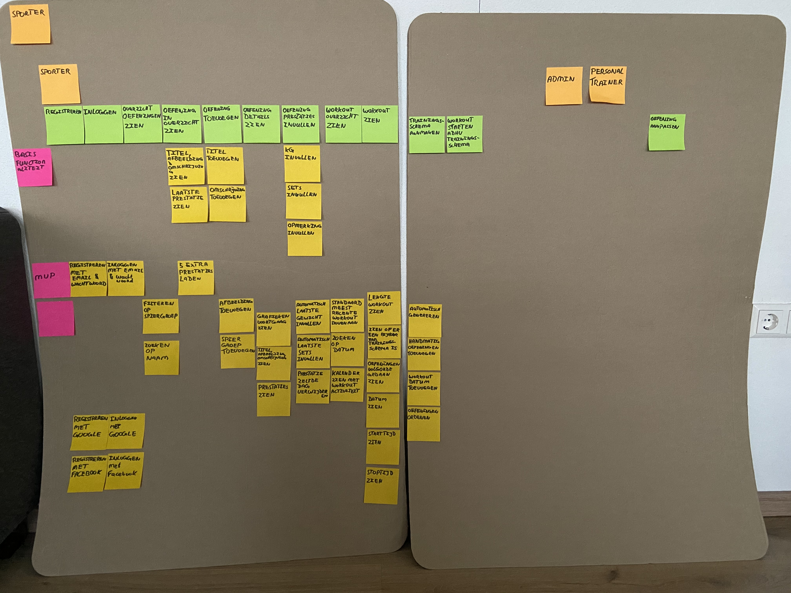

# Sprint Review 0
Fitness tracker applicatie

## Project omschrijving
Deze applicatie is gericht op fitnessers en personal trainers. De fitnesser kan zijn of haar prestaties vastleggen: welke oefening, met het gewicht en het aantal herhalingen. Deze prestaties kunnen bekeken worden door de sporter en de personal trainer. Voor de sporter heeft dit een motiverende werking omdat ie zijn vooruitgang kan zien. De personal trainer kan met deze resultaten zien of de sporter nog effectief bezig is. Dit is de basis van de applicatie, de MVP (Minimal Viable Product) zoals de story map hieronder laat zien.

Met alleen de MVP gerealiseerd zal de sporter elke oefening die hij/zij doet opzoeken en een nieuwe prestaties invullen. Later zal de sporter of personal trainer ook een trainingsschema kunnen maken. Dan kan de sporter vanuit het trainingsschema de nieuwe prestaties invullen en de oefeningen doen.

Vanuit deze schema’s en oefeningen apart in te vullen worden workouts gegenereerd. Een workout bestaat uit de prestaties van een of meerdere oefeningen die op één dag zijn gedaan. Met workouts is het makkelijker voor de sporter en personal trainer om terug te kijken wat de sporter de afgelopen dagen heeft gedaan in plaats van per oefening te kijken wanneer die voor het laatst is uitgevoerd.

Met de data van deze applicatie kan er misschien automatisch trainingsschema’s worden gegenereerd op basis van de huidige vooruitgang en de doelen. Of kan men kijken wat de meest effectieve manier van trainen is.

## Sprintdoelen
### Sprint 0
* Opzet project

### Sprint 1
* De functionaliteit van de MVP zodat de applicatie zo snel mogelijk in gebruik genomen kan worden.

## Sprint resultaten
### Sprint 0
* Functionaliteit in beeld en geprioriteerd
* Git repo opgezet
* Wireframes getekend
* Frontend opgezet
* Begin gemaakt aan BFF (Backend For Frontend)
* Gekeken naar CICD tools (Azure, Jenkins, TeamCity & GitHub Actions)

## Project management tool
Om alle functionaliteit en de prioriteit in beeld te brengen wordt een fysieke story map gebruikt. Voor de sprintbacklog wordt Azure gebruikt.

## CICD Pipeline
Het wordt TeamCity of GitHub Actions.

## Technieken
* Angular
* C#, ASP.NET Core
* KAFKA of RabbitMQ
* Docker en Kubernetes