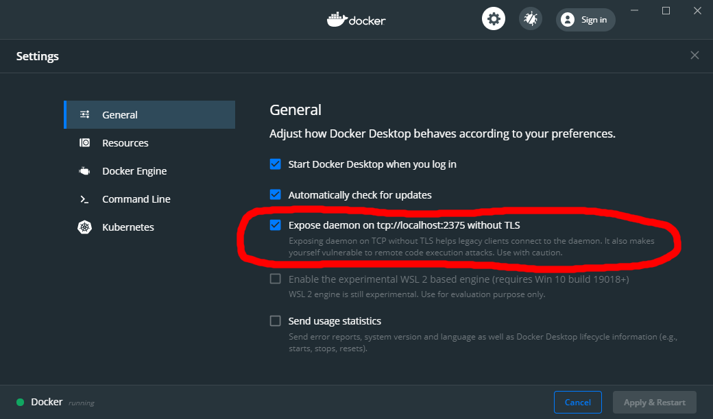

# Install Docker client in WSL

1. Install docker in the WSL as described on the [official docker page](https://docs.docker.com/install/linux/docker-ce/ubuntu/).

2. Enable the "Expose deamon without TLS" option on the docker running on your windows system.


3. Run this command and you should see the docker images on your windows host
```
docker -H localhost:2375 images
```

4. Add this environment variable to your .bash_profile so you don't have to define the docker host with each command.
```
echo "export DOCKER_HOST=localhost:2375" >> ~/.bash_profile
```

5. Ensure Volume Mounts Work
The last thing we need to do is set things up so that volume mounts work. This tripped me up for a while because check this out…


When using WSL, Docker for Windows expects you to supply your volume paths in a format that matches this: /c/Users/nick/dev/myapp.


But, WSL doesn’t work like that. Instead, it uses the /mnt/c/Users/nick/dev/myapp format. Honestly I think Docker should change their path to use /mnt/c because it’s more clear on what’s going on, but that’s a discussion for another time.


To get things to work for now, you have 2 options. If you’re running Windows 18.03 (Spring 2018) or newer you can configure WSL to mount at / instead of /mnt and you’re all done. If you’re running 17.09 (Fall 2017) you’ll need to do something else.


Here’s step by step instructions for both versions of Windows:


## Running Windows 10 18.03+ or Newer?
First up, open a WSL terminal because we need to run a few commands.


### Create and modify the new WSL configuration file:
```
sudo nano /etc/wsl.conf

# Now make it look like this and save the file when you're done:

[automount]
root = /
options = "metadata"
```
We need to set root = / because this will make your drives mounted at /c or /e instead of /mnt/c or /mnt/e.

The options = "metadata" line is not necessary but it will fix folder and file permissions on WSL mounts so everything isn’t 777 all the time within the WSL mounts. I highly recommend you do this!

Once you make those changes, sign out and sign back in to Windows to ensure the changes take effect. Win + L isn’t enough. You’ll need to do a full blown sign out / sign in.

[Source (Ensure Volume Mounts Work)](https://nickjanetakis.com/blog/setting-up-docker-for-windows-and-wsl-to-work-flawlessly)